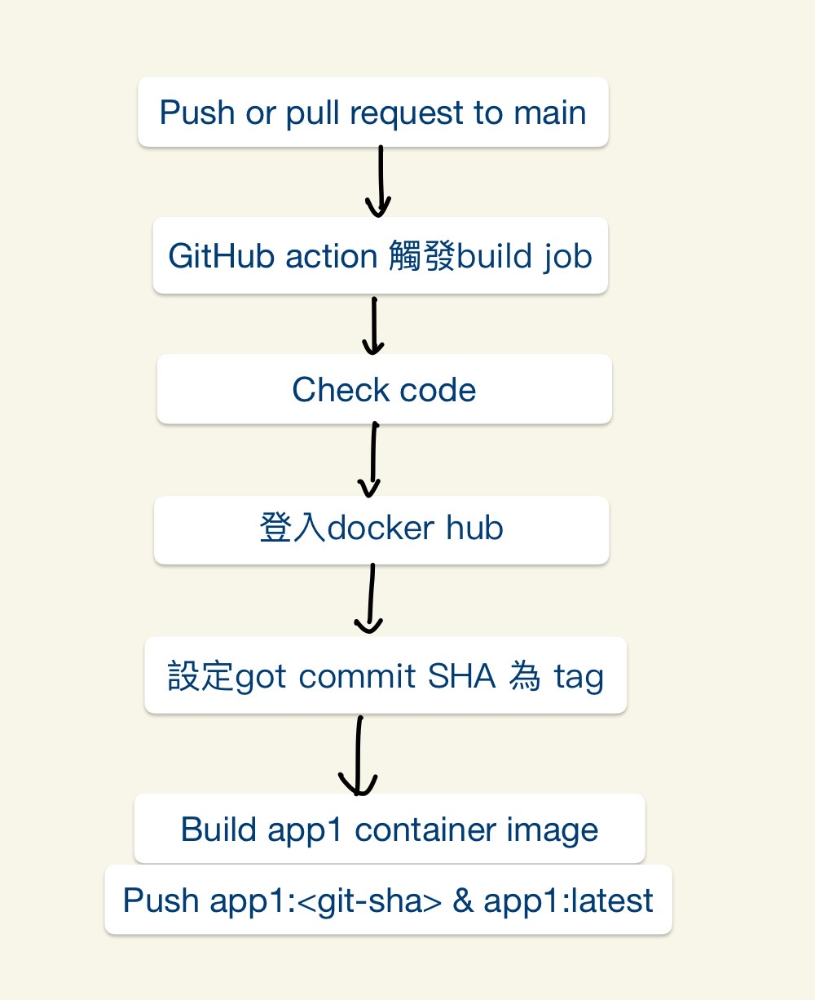

# cloud_native_hw4

## Dockerfile

in folder app1 & app2
```bash
cloud_native_hw4/
├── README.md
├── app1/
│   ├── app.py
│   └── Dockerfile
└── app2/
    ├── app.py
    └── Dockerfile
```

## docker build
```bash    
    // in folder app1
    // use young0319/2025cloud as image name, app1 as tag name
    docker build -t young0319/2025cloud:app1 .
```
## docker run
```bash
    docker run young0319/2025cloud:app1
```


## 自動化產生 Container Image的邏輯，以及 Tag 的選擇邏輯


🔹 A. Push or Pull Request to main 
當你對 main 分支進行 push 或發起 pull request，會觸發 GitHub Actions 的工作流程。

🔹 B. GitHub Actions 觸發 build job  
GitHub 偵測到事件後，啟動 CI/CD pipeline（build job 開始執行）。

🔹 C. Checkout code  
這步驟會把 GitHub Repo 裡的程式碼下載到 runner（虛擬機器）上，讓接下來的步驟能操作程式檔案（像是 Dockerfile, app.py 等）。

🔹 D. 登入 DockerHub  
使用你在 GitHub Secrets 中設定的帳號密碼登入 DockerHub，才能夠推送（push）映像檔。

🔹 E. 設定 Git Commit SHA 為 tag  
從目前的 Git commit SHA 擷取前 7 碼，例如 a1b2c3d，作為映像檔的 tag，方便追蹤是哪一次提交產生的。

🔹 F. Build app1 container image
執行 docker build 指令，用 ./app1/Dockerfile 製作出一個映像檔。

🔹 G. ```Push app1:<git-sha> & app1:latest```  
將剛剛 build 好的映像檔推送到 DockerHub：

app1:git-abc1234 → 方便追蹤版本  
app1:latest → 讓用戶拉到最新版本